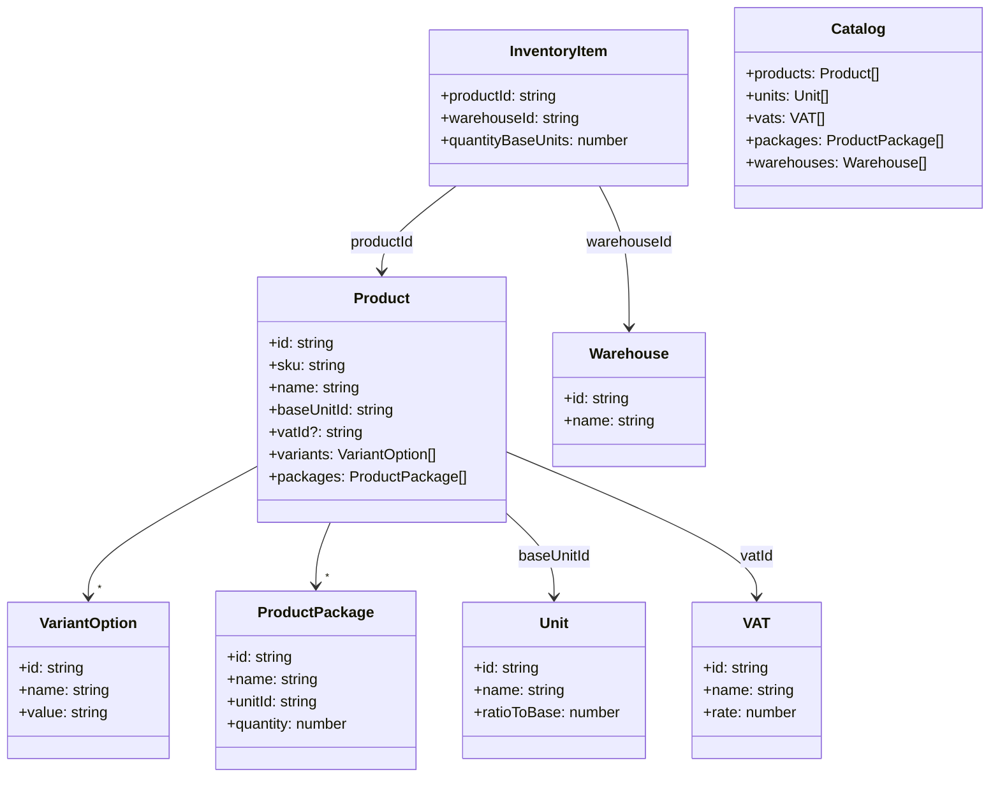
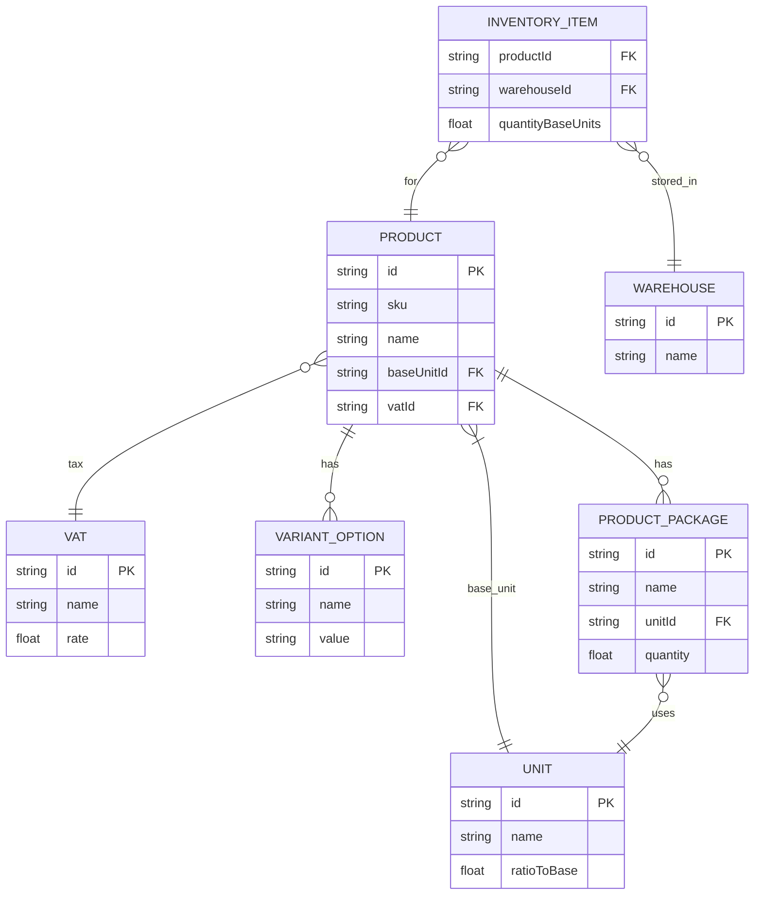

# @fantasizetech/inventory-support

Client-side inventory toolkit for React with optional integrations for Jotai, Zustand, Redux, and MobX. Requires Node 20+.

## Features

- Product catalog with Units, VAT, Packages, Warehouses
- Per-warehouse stock management
- Convert between base units and custom units
- React Context provider + hook (batteries-included)
- Optional adapters for Jotai, Zustand, Redux, MobX

## Install

```
npm i @fantasizetech/inventory-support
```

Peer dependencies:

```
npm i react react-dom
```

Optional adapters:

```
npm i jotai zustand redux mobx --save-optional
```

## Pick Your State Management

You have five options depending on your stack and preference.

1. React Context (built-in, no extra installs)

```tsx
import { InventoryProvider, useInventory } from '@fantasizetech/inventory-support';

function App() {
  const { state, dispatch } = useInventory();
  return <div>...</div>;
}

// At the root
<InventoryProvider
  initialState={
    {
      /* optional initial data */
    }
  }
>
  <App />
</InventoryProvider>;
```

2. Jotai (install `jotai`)

```tsx
import { atom, useAtom } from 'jotai';
import type { InventoryState } from '@fantasizetech/inventory-support';

const inventoryAtom = atom<InventoryState>({
  catalog: { products: [], units: [], vats: [], packages: [], warehouses: [] },
  stock: [],
});

function JotaiInventoryView() {
  const [state, setState] = useAtom(inventoryAtom);
  // Update: setState(prev => ({ ...prev, stock: [...] }))
  return <pre>{JSON.stringify(state, null, 2)}</pre>;
}
```

3. Zustand (install `zustand`)

```tsx
import { create } from 'zustand';
import type { InventoryState } from '@fantasizetech/inventory-support';

type InvStore = InventoryState & {
  setCatalog: (c: InventoryState['catalog']) => void;
  setStock: (s: InventoryState['stock']) => void;
};

const useInvStore = create<InvStore>((set) => ({
  catalog: { products: [], units: [], vats: [], packages: [], warehouses: [] },
  stock: [],
  setCatalog: (catalog) => set({ catalog }),
  setStock: (stock) => set({ stock }),
}));

function ZustandInventoryView() {
  const { catalog, stock, setStock } = useInvStore();
  return <pre>{JSON.stringify({ catalog, stock }, null, 2)}</pre>;
}
```

4. Redux (install `redux` and/or `@reduxjs/toolkit`)

```ts
import type { InventoryState, InventoryAction } from '@fantasizetech/inventory-support';

const initial: InventoryState = {
  catalog: { products: [], units: [], vats: [], packages: [], warehouses: [] },
  stock: [],
};

export function inventoryReducer(state = initial, action: InventoryAction): InventoryState {
  switch (action.type) {
    case 'SET_CATALOG':
      return { ...state, catalog: action.catalog };
    case 'SET_STOCK':
      return { ...state, stock: action.stock };
    case 'INCREMENT_STOCK': {
      const idx = state.stock.findIndex((i) => i.productId === action.productId && i.warehouseId === action.warehouseId);
      const updated = [...state.stock];
      if (idx >= 0) updated[idx] = { ...updated[idx], quantityBaseUnits: updated[idx].quantityBaseUnits + action.quantityBaseUnits };
      else updated.push({ productId: action.productId, warehouseId: action.warehouseId, quantityBaseUnits: action.quantityBaseUnits });
      return { ...state, stock: updated };
    }
    case 'DECREMENT_STOCK': {
      const idx = state.stock.findIndex((i) => i.productId === action.productId && i.warehouseId === action.warehouseId);
      const updated = [...state.stock];
      if (idx >= 0) updated[idx] = { ...updated[idx], quantityBaseUnits: Math.max(0, updated[idx].quantityBaseUnits - action.quantityBaseUnits) };
      return { ...state, stock: updated };
    }
    default:
      return state;
  }
}
```

5. MobX (install `mobx`)

```ts
import { makeAutoObservable } from 'mobx';
import type { InventoryState } from '@fantasizetech/inventory-support';

class InventoryStore implements InventoryState {
  catalog = { products: [], units: [], vats: [], packages: [], warehouses: [] };
  stock = [] as InventoryState['stock'];
  constructor() {
    makeAutoObservable(this);
  }
  setCatalog(c: InventoryState['catalog']) {
    this.catalog = c;
  }
  setStock(s: InventoryState['stock']) {
    this.stock = s;
  }
}

export const inventoryStore = new InventoryStore();
```

## Quick Start (React)

```tsx
import React from 'react';
import { createRoot } from 'react-dom/client';
import { InventoryProvider, useInventory } from '@fantasizetech/inventory-support';

function App() {
  const { state, dispatch, stockInUnits } = useInventory();

  React.useEffect(() => {
    dispatch({
      type: 'SET_CATALOG',
      catalog: {
        products: [{ id: 'p1', sku: 'SKU-1', name: 'Rice', baseUnitId: 'kg' }],
        units: [{ id: 'kg', name: 'Kilogram', ratioToBase: 1 }],
        vats: [{ id: 'vat20', name: 'VAT 20%', rate: 0.2 }],
        packages: [{ id: 'bag5kg', name: 'Bag 5kg', unitId: 'kg', quantity: 5 }],
        warehouses: [{ id: 'w1', name: 'Main' }],
      },
    });
    dispatch({ type: 'SET_STOCK', stock: [{ productId: 'p1', warehouseId: 'w1', quantityBaseUnits: 20 }] });
  }, [dispatch]);

  const product = state.catalog.products[0];
  const warehouse = state.catalog.warehouses[0];
  const stock = product && warehouse ? stockInUnits(product, warehouse) : { baseUnits: 0, units: 0 };

  return (
    <div>
      <h1>Inventory Demo</h1>
      <p>
        Stock for {product?.name}: {stock.baseUnits} kg
      </p>
    </div>
  );
}

createRoot(document.getElementById('root')!).render(
  <InventoryProvider>
    <App />
  </InventoryProvider>
);
```

## Frontend UI Example (form + list)

Small UI showing catalog + stock with a create form:

```tsx
import React from 'react';
import { createRoot } from 'react-dom/client';
import { InventoryProvider, useInventory } from '@fantasizetech/inventory-support';

function InventoryDashboard() {
  const { state, dispatch, stockInUnits } = useInventory();
  const [sku, setSku] = React.useState('');
  const [name, setName] = React.useState('');
  const [qty, setQty] = React.useState(0);

  const addProduct = () => {
    dispatch({
      type: 'SET_CATALOG',
      catalog: {
        ...state.catalog,
        products: [...state.catalog.products, { id: sku, sku, name, baseUnitId: 'unit' }],
        units: state.catalog.units.length ? state.catalog.units : [{ id: 'unit', name: 'Unit', ratioToBase: 1 }],
      },
    });
    dispatch({
      type: 'SET_STOCK',
      stock: [...state.stock, { productId: sku, warehouseId: 'main', quantityBaseUnits: qty }],
    });
    setSku('');
    setName('');
    setQty(0);
  };

  return (
    <div style={{ display: 'grid', gap: 16 }}>
      <h1>Inventory Dashboard</h1>

      <section>
        <h2>Add Product</h2>
        <label>
          SKU: <input value={sku} onChange={(e) => setSku(e.target.value)} />
        </label>
        <label>
          Name: <input value={name} onChange={(e) => setName(e.target.value)} />
        </label>
        <label>
          Quantity: <input type="number" value={qty} onChange={(e) => setQty(Number(e.target.value))} />
        </label>
        <button onClick={addProduct} disabled={!sku || !name}>
          Add
        </button>
      </section>

      <section>
        <h2>Stock</h2>
        <ul>
          {state.catalog.products.map((p) => {
            const stock = stockInUnits(p, { id: 'main', name: 'Main' });
            return (
              <li key={p.id}>
                {p.sku} – {p.name}: {stock.baseUnits} units
              </li>
            );
          })}
        </ul>
      </section>
    </div>
  );
}

createRoot(document.getElementById('root')!).render(
  <InventoryProvider
    initialState={{
      catalog: {
        products: [],
        units: [{ id: 'unit', name: 'Unit', ratioToBase: 1 }],
        vats: [],
        packages: [],
        warehouses: [{ id: 'main', name: 'Main' }],
      },
      stock: [],
    }}
  >
    <InventoryDashboard />
  </InventoryProvider>
);
```

## Generic Meta Model (extensible types)

All core entities can be extended via generics while preserving the required relations (Product ↔ Variant ↔ Warehouse ↔ Multiple Unit + VAT/Package).

Example: add `brand` to Product and `location` to Warehouse and get a strongly-typed Provider/Hook via `createInventoryContext`.

```tsx
import { createInventoryContext } from '@fantasizetech/inventory-support';

type ProductExtra = { brand?: string };
type WarehouseExtra = { location?: string };

const { InventoryProvider: InvProviderX, useInventory: useInvX } = createInventoryContext<ProductExtra, {}, {}, {}, {}, WarehouseExtra>();

function AppX() {
  const { state, dispatch } = useInvX();
  return <div />;
}

<InvProviderX initialState={{}}>
  <AppX />
</InvProviderX>;
```

Important: required fields must remain (e.g., `product.id`, `product.baseUnitId`, `variant.id`, `warehouse.id`, `unit.id`, `ratioToBase`) so utilities and stock math keep working.

## Units, VAT, Packages

- Every Product references a base unit via `baseUnitId`.
- VATs are separate and linked by `vatId`.
- Packages model packaged quantities for a product (e.g., 5kg bag).

## UML Class Diagram



## ER Diagram



## Change Impact (use cases)

- Change `Unit.ratioToBase`: affects conversions in `toUnits`/`fromUnits` and all stock derived from that unit.
- Remove a `Unit` still referenced by `Product.baseUnitId` or `ProductPackage.unitId`: prevent or migrate before removal.
- Change `ProductPackage.quantity`: affects pack-to-base conversions in stock and UI.
- Change `VAT.rate`: impacts tax calculation for linked products (if you consume `vatId` downstream for pricing).
- Move stock between warehouses: update `InventoryItem` records to decrease source and increase destination.

## Optional Store Integrations

Adapters provide type helpers so you can wire your own stores:

- Jotai: `JotaiInventoryStore` with an `Atom<InventoryState>`
- Zustand: `ZustandInventoryStore` as `StoreApi<InventoryState>`
- Redux: `ReduxInventoryStore` as `Store<InventoryState>`
- MobX: `MobxInventoryStore<T>` placeholder for your observable

## API

- `createInventoryContext<...>()`: create a strongly-typed Provider/Hook using your generic meta
- `InventoryProvider`: default provider (uses base generics)
- `useInventory()`: returns `{ state, dispatch, stockInUnits }`
- `inventory-utils`: `toUnits`, `fromUnits`, `getStockForProduct`, `unitById`
- Types: `Product`, `Unit`, `VAT`, `VariantOption`, `ProductPackage`, `Warehouse`, `InventoryItem`, `Catalog`, `InventoryState`

## Engines

- Node: `>=20`
